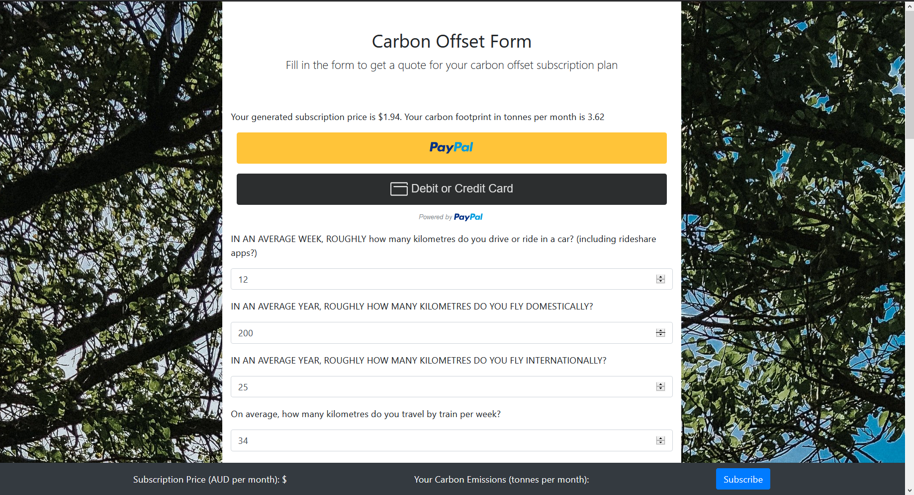

# Form Page
A Flask form page, initially created for ENACTUS Melbourne, but the sensitive data has been removed.
Communicates with the Paypal API to create unique subscription plans.


To run this Flask server on your own computer,
- install the dependencies/requirements listed below
- run ```python main.py```, NOTE: your terminal/shell must be in the same directory as the file containing main.py. Also note that you likely don't have a MySQL server so errors may arise, to remove, you would need to comment out some SQL code.

Note the MAIN form page, should be the ```templates/paypal_page.html``` file.

# Preview Images




# Requirements
- WTForms (2.3.3)
- Flask (1.1.2)
- requests (2.22.0)

To install the dependencies/requirements:
do ```pip install -r requirements.txt```

# On changes
If any changes need to be made, keep these in mind and update accordingly (NOTE: not exhaustive, just helping):
- If different paypal account is used (which is meant to receive the funds)
    - remember to change your APIKeys values in ```my_paypal_module.py```
- If changing fields, remember to be careful with main.js, paypal_page.html and the WTForms things
- If migrating to a different pythonanywhere account/server, remember to update WTForms (at least on pythonanywhere), otherwise it won't work
    - ```python3 -m pip install --user --upgrade wtforms```


